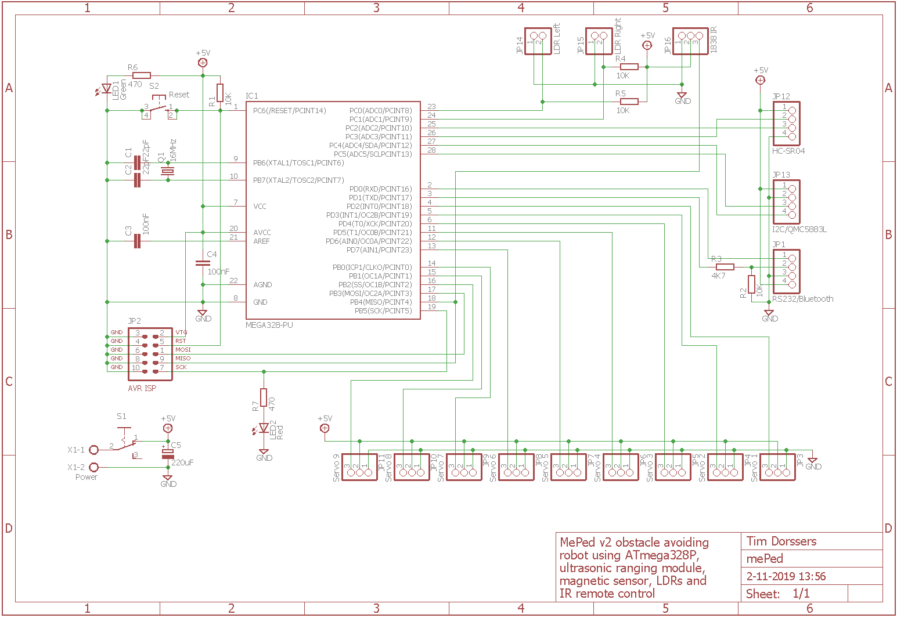
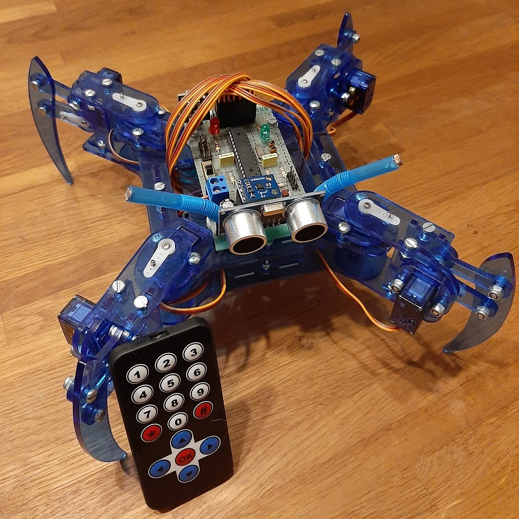

# mePed
[mePed v2](http://www.meped.io/mepedv2) obstacle avoiding remote controlled light sensitive quadruped robot

## Overview
The quadruped robot uses the HC-SR04 module as eyes and it uses the LDRs to sense light. The HC-SR04 module is connected to PCINT10 and uses the 8-bit Timer0 interrupt to measure RTT. The LDRs are connected to ADC0 and ADC1.

When an obstacle is detected within 30 cm distance, the robot turns in the brightest direction, using the magnetic heading to turn at least 75 degrees. When an obstacle is detected ahead within 15 cm distance, the robot reverses until no obstacle is detected within 30 cm distance and then turns to the brightest direction. The walking speed, robot height and leg positions are adjustable. Debugging data is sent to the hardware UART.

Eight servos are connected to PORTD and PORTB and are driven by a software PWM implementation using the 16-bit Timer1 output compare interrupt.

The IR remote receiver uses the 8-bit Timer2 interrupt to collect data.

Hardware I2C is used to read out the QMC5883L sensor. The raw readings are converted to a heading in degrees. Automatic scaling and centering data is stored in EEPROM.

The robot can be controlled with an IR remote control and RS232 or BT.

## Hardware
* Atmel ATmega328P @ 16 MHz
* HC-SR04 Ultrasonic Ranging Module
* SG90 Servos
* 1838 IR Receiver
* QMC5883L Magnetic Sensor
* GL5528 LDRs

## Schematic

## UART Control
The UART is configured for 9600 baud 8N1. The following keys are understood by the robot:

Key | Function
---- | ----
A | Turn left
D | Turn right
W | Move forward
S | Move backward
L | Lean left
R | Lean right
C | Center servos
B | Bow
U | Stand higher
N | Stand lower
T | Trim more
I | Trim less
E | Reset bounds
F | Move faster
O | Move slower
space | Autonomous gait algorithm

## IR Remote Control
These NEC protocol based IR remote control keys are understood by the robot:

Key | Value | Function
---- | ---- | ----
Left | 16716015 | Turn left
Right | 16734885 | Turn right
Up | 16718055 | Move forward
Down | 16730805 | Move backward
OK | 16726215 | Autonomous gait algorithm
\* | 16738455 | Lean left
\# | 16756815 | Lean right
0 | 16750695 | Center servos
1 | 16753245 | Stand higher
2 | 16736925 | Trim more
3 | 16769565 | Move faster
4 | 16720605 | Stand lower
5 | 16712445 | Trim lower
6 | 16761405 | Move slower
7 | 16769055 | Reset bounds
8 | 16754775 | Bow
9 | 16748655 | Unused

## Build
The robot is built using a mePed body and the hardware listed is connected according to the schematic.

## Firmware
The firmware has been developed in Atmel Studio 7 using GCC C and can be uploaded to the ATmega328P using the ISP connector and an ISP programmer such as [USBasp tool](http://www.fischl.de/usbasp/) using [avrdude](http://www.nongnu.org/avrdude/):

`avrdude -p m328p -c usbasp -U flash:w:mePed.hex:i -U hfuse:w:0xD9:m -U lfuse:w:0xDE:m`

## Gallery

